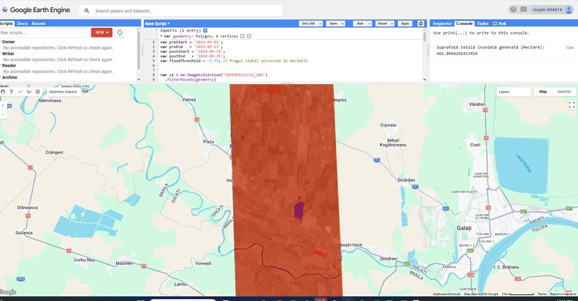
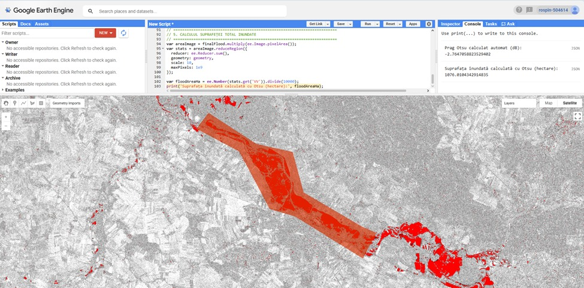
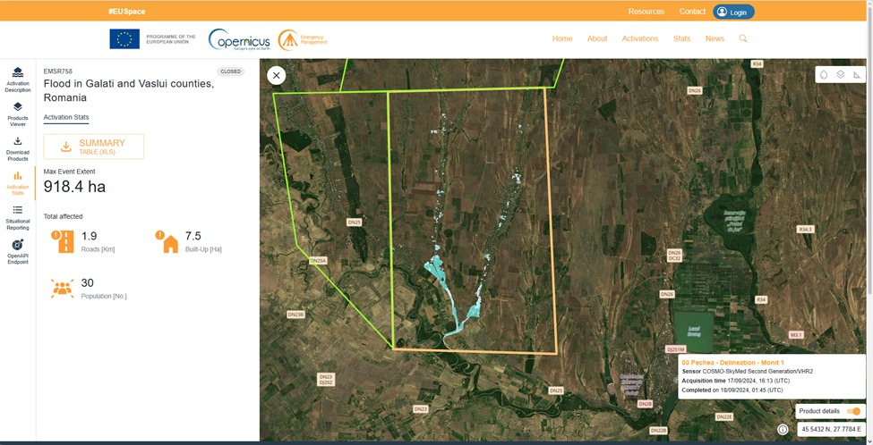
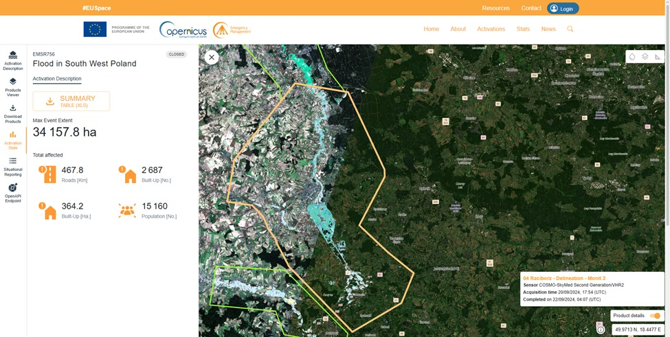

# Flood extent mapping with SAR (Sentinel‑1) — GEE + Copernicus EMS validation

This project was developed as part of the **ROSPIN Summer School**.  
ROSPIN GitHub organisation: https://github.com/Romanian-Space-Initiative

## Goal
Map flood extent from **Sentinel‑1 SAR (VV)** in Google Earth Engine and validate results against **Copernicus Emergency Management Service (EMS)** statistics.

## EMS activations used (reference)
- **EMSR756 — Flood in South West Poland (AOI: Racibórz)**  
  https://mapping.emergency.copernicus.eu/activations/EMSR756/stats
- **EMSR758 — Flood in Galați and Vaslui counties, Romania (AOI: Pechea)**  
  https://mapping.emergency.copernicus.eu/activations/EMSR758/stats 

EMS reference tables are stored in `data/ems/`.

## Repository structure
- `gee/` — Google Earth Engine scripts
- `data/ems/` — Copernicus EMS XLS reference tables
- `figures/` — screenshots (GEE demo + EMS stats/tables)
- `results/` — CSV with area estimates and EMS reference numbers
- `docs/` — methods/validation report + 1-page startup pitch

## How to run (Google Earth Engine)
1. Open the GEE Code Editor: https://code.earthengine.google.com/
2. Create a new script and paste one of the scripts from `gee/`:
   - `flood_fixed_threshold.js`
   - `flood_otsu_difference.js`
3. Draw or import an AOI and make sure it is named **`geometry`**
4. Adjust `preStart/preEnd/postStart/postEnd` if needed
5. Click **Run**
6. Read the flooded area (ha) printed in the Console

## Methods
- Sentinel‑1 VV pre/post compositing (median or mean)
- Flood detection by SAR backscatter change thresholding:
  - fixed threshold on (POST − PRE)
  - Otsu automatic threshold on (POST − PRE)
- Filtering:
  - permanent water removed using JRC Global Surface Water (occurrence > 80%)
  - steep slopes removed using SRTM slope (> 5°)
- See `docs/methods_and_validation.md`

## Results
- Computed areas: `results/area_estimates.csv`
- EMS reference numbers: `results/ems_reference_stats.csv`

## Example outputs (screenshots)

**Romania — Pechea (fixed threshold)**

**Poland — Racibórz (Otsu on difference)**

**Copernicus EMS reference — EMSR758 (Romania)**

**Copernicus EMS reference — EMSR756 (Poland)**
 

## Startup angle
A proposed productization is described in `docs/pitch_onepager.md`: rapid flood extent reports for **insurers and local authorities**. 